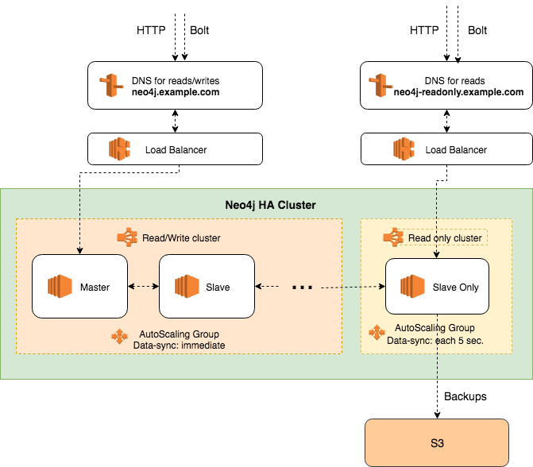

# neo4j-aws-ha-cluster

A setup for HA (High-Availability) deployment of a [Neo4j Enterprise](https://neo4j.com/subscriptions/#editions) cluster on top of [AWS ECS](https://aws.amazon.com/ecs/).

### Includes:
- Customizable CloudFormation template.
- Custom docker image on top [official Neo4j image](https://hub.docker.com/_/neo4j/). Current version - *Neo4j 3.4.6*

## Features

* Automatic daily backups to S3 using a slave-only instance.
* Bootstrap a cluster from a backup snapshot.
* Autoscaling (based on Memory Utilization).
* CloudWatch alerts setup.
* Bootstrap a node with an existing data volume for quick startup.
* Automatically create users+credentials for read-only and read/write access.

## Prerequisites:

* Install [Docker](https://docs.docker.com/engine/installation/) to build the image.
* [AWS CLI](https://aws.amazon.com/cli) for uploading images to ECR.

## How does it work?



Neo4j graph database is deployed as a highly-available (HA) cluster with master-slave replication. 

It uses [Bolt](https://boltprotocol.org/) – a highly efficient, lightweight binary client-server protocol designed for database applications.

Essentially it's a Neo4j cluster with a minimum of 2 nodes (use at least 3 for HA), which is split logically into 2 ECS clusters (yet still it's 1 Neo4j cluster):

### A Read-Write cluster with one master node and multiple slaves:
- Fast synchronisation between and master and nodes.
- Load Balancer keeps only a current master node in service. Hence slaves act like hot-standby in case of a failover.
- All nodes are eligible for becoming a master. Reelection will be quickly spotted by ELB.

### A Read-only cluster with one slave node:
- Slower synchronisation.
- Can not become master.
- Can not accept write queries.
- Can handle complex queries without affecting performance of the R/W cluster.
- Still participates in master elections.
- Can be deployed as a different EC2 instance type for temporary heavy analytics.
- Load Balancer keeps this single node in service.
- Backups are performed on this node to avoid performance hits on R/W nodes.
- On testing environment its not present, and only a single node in the main cluster is doing the backups.

Ports open:

```
  - HTTP(s): 7473, 7474
  - Bolt: 7687
```

## Usage

1. Create an ECR repository for Neo4j custom images. You will use it's ARN.
   (ARN looks like `arn:aws:ecr:us-east-1:123456789012:repository/neo`).

2. Save environment variable for use in makefile (customize them first)

        $ export NEO_ECR_REPO=<paste here ARN of your ECR repo>
        $ export NEO_AWS_REGION=<your AWS region>

3. Build Docker image and push it to your ECR:

        $ make build
        $ make push_image

4. Feel free to modify `cloudformation.yml` in any way you like before spinning up infrastructure, however most of the things are customizable via parameters.

5. [Create a Cloud Formation stack](https://console.aws.amazon.com/cloudformation/home#/stacks/new) using `cloudformation.yml` or just click:

    [](https://console.aws.amazon.com/cloudformation/home#/stacks/new?stackName=neo4j-ha-cluster&templateURL=https://raw.githubusercontent.com/getsocial-rnd/neo4j-aws-ha-cluster/master/cloudformation.yml)

   During this step you will define all the resources you need and configure Docker image with Neo4j for ECS.
    Please make sure to set 2 tags for your stack (on "Options" page):

        Name: <how you name your stack>
        Environment: <your env name, e.g production>

## Upgrade version

Please see [detailed instructions](./UPGRADE_README.md) to upgrade using this CF template.


## Known Problems

* You can't restore server from a backup without a downtime. See [further instructions](https://neo4j.com/docs/operations-manual/current/backup/restore-backup/#backup-restore-ha-cluster).
* Autoscaling is hardcoded via RAM utilization (>70%). Feel free to modify for your own needs.
* Sometimes, rolling updates, that require nodes reboot, render them stuck for some time before rejoining cluster. Probaly a slower rolling update can help so that at each moment at least one node is already registered in main ELB as master.

## TODO

```
* Parametrize autoscaling.
* Allow disabling slave-only more for simplest 1-node setups.
```
